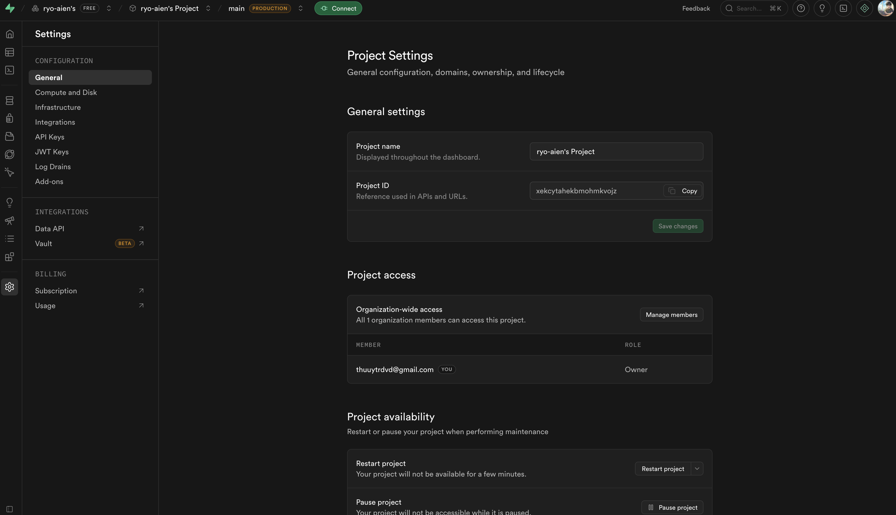
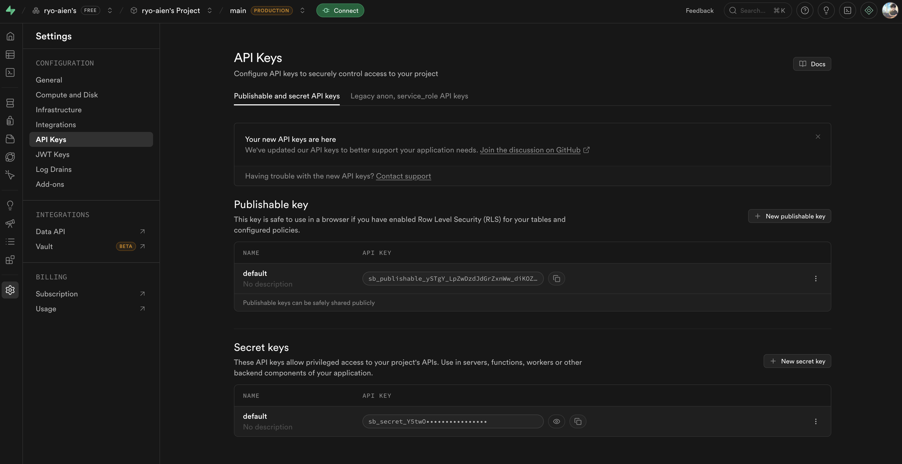

# 公式ウェブサイト

カフェの公式ウェブサイト＋自作CMS。Next.js + Supabase で構築。

## 技術スタック

- **Next.js 14** (App Router)
- **TypeScript**
- **Tailwind CSS**
- **Supabase**（データベース・画像ストレージ・認証）
- **Vercel**

---

## ページ構成

### 公開サイト

| パス | 内容 |
|------|------|
| `/` | トップページ |
| `/cast` | キャスト一覧 |
| `/cast/[slug]` | キャスト詳細 |
| `/schedule` | 出勤スケジュール |
| `/system` | 料金・メニュー |
| `/news` | ニュース一覧 |
| `/news/[slug]` | ニュース詳細 |
| `/gallery` | ギャラリー |
| `/access` | アクセス |
| `/recruit` | 採用情報 |

### 管理画面

| パス | 内容 |
|------|------|
| `/admin/login` | ログイン |
| `/admin` | ダッシュボード |
| `/admin/cast` | キャスト管理 |
| `/admin/schedule` | シフト管理 |
| `/admin/news` | ニュース管理 |
| `/admin/gallery` | ギャラリー管理 |
| `/admin/shop` | 店舗情報管理 |

---

## セットアップ

### 1. Supabase プロジェクト作成

1. [supabase.com](https://supabase.com) にログインし、**New Project** を作成
2. プロジェクト名・パスワード・リージョン（Northeast Asia / Tokyo 推奨）を設定

---

### 2. データベースのテーブル作成

Supabase の **SQL Editor** を開き、以下の SQL ファイルを順番に実行する。

| 順番 | ファイル | 内容 |
|------|---------|------|
| 1 | [supabase/schema.sql](supabase/schema.sql) | テーブル作成・初期データ |
| 2 | [supabase/rls.sql](supabase/rls.sql) | Row Level Security の設定 |

---

### 3. Storage のバケット作成

Supabase の **Storage** を開き、以下のバケットを作成する。  
各バケットとも **Public bucket** にチェックを入れること。

| バケット名 | 用途 |
|-----------|------|
| `cast-images` | キャスト画像 |
| `news-images` | ニュース画像 |
| `gallery-images` | ギャラリー画像 |
| `shop-images` | 店舗バナー画像 |

---

### 4. オーナーアカウントの作成

1. Supabase の **Authentication > Users** を開く
2. **Invite user** でオーナーのメールアドレスを入力して招待メールを送る
3. オーナーがメールのリンクからパスワードを設定してログイン完了
4. 作成されたユーザーの UUID を確認し、**SQL Editor** で以下を実行してオーナー権限を付与する

```sql
insert into profiles (id, role)
values ('ここにオーナーのUUIDを貼る', 'owner');
```

---

### 5. 環境変数の設定

`.env.local.example` をコピーして `.env.local` を作成する。

```bash
cp env.local.example .env.local
```

各値は Supabase の **Project Settings** から取得する。

---

#### `NEXT_PUBLIC_SUPABASE_URL` の取得

**Project Settings > General** を開く。



**Project ID** の欄に表示されている値をもとに、以下の形式で設定する。

```
https://<Project ID>.supabase.co
```

---

#### `NEXT_PUBLIC_SUPABASE_ANON_KEY` / `SUPABASE_SERVICE_ROLE_KEY` の取得

**Project Settings > API Keys** を開く。



| 変数名 | 取得場所 | 説明 |
|--------|---------|------|
| `NEXT_PUBLIC_SUPABASE_URL` | Settings > General > Project ID | `https://<ID>.supabase.co` の形式で設定 |
| `NEXT_PUBLIC_SUPABASE_ANON_KEY` | **Publishable key** > default の API KEY | `sb_publishable_...` で始まるキー。ブラウザに公開してOK |
| `SUPABASE_SERVICE_ROLE_KEY` | **Secret keys** > default の API KEY（目のアイコンで表示） | `sb_secret_...` で始まるキー。絶対に公開しないこと |
| `REVALIDATE_SECRET` | 任意の文字列を自分で決める | ISR ページ再生成用。`openssl rand -hex 32` 等で生成推奨 |

---


## デプロイ（Vercel）

### 1. New Project の作成

1. [vercel.com](https://vercel.com) にログインし、**Add New > Project** を開く
2. GitHub リポジトリをインポートする

### 2. プロジェクト設定

| 項目 | 設定値 |
|------|--------|
| Framework Preset | `Next.js` |
| Root Directory | `.`（デフォルトのまま） |
| Build Command | `npm run build`（デフォルトのまま） |
| Output Directory | `.next`（デフォルトのまま） |
| Install Command | `npm install`（デフォルトのまま） |

### 3. 環境変数の設定

**Environment Variables** セクションで以下を追加する。

| Name | Environment |
|------|-------------|
| `NEXT_PUBLIC_SUPABASE_URL` | Production, Preview, Development |
| `NEXT_PUBLIC_SUPABASE_ANON_KEY` | Production, Preview, Development |
| `SUPABASE_SERVICE_ROLE_KEY` | Production, Preview, Development |
| `REVALIDATE_SECRET` | Production, Preview, Development |

### 4. デプロイ

**Deploy** ボタンを押してデプロイ完了。以降は `main` ブランチへの push で自動デプロイされる。

---

## キャストアカウントの追加方法

1. **Authentication > Users** で **Invite user** からキャストのメールアドレスを招待
2. キャストがパスワードを設定してログイン
3. 先にキャストのプロフィールを `/admin/cast` から作成しておく
4. **SQL Editor** で以下を実行してキャスト権限を付与する

```sql
insert into profiles (id, role, cast_id)
values (
  'キャストのUUID',
  'cast',
  'キャストテーブルのID'
);
```
